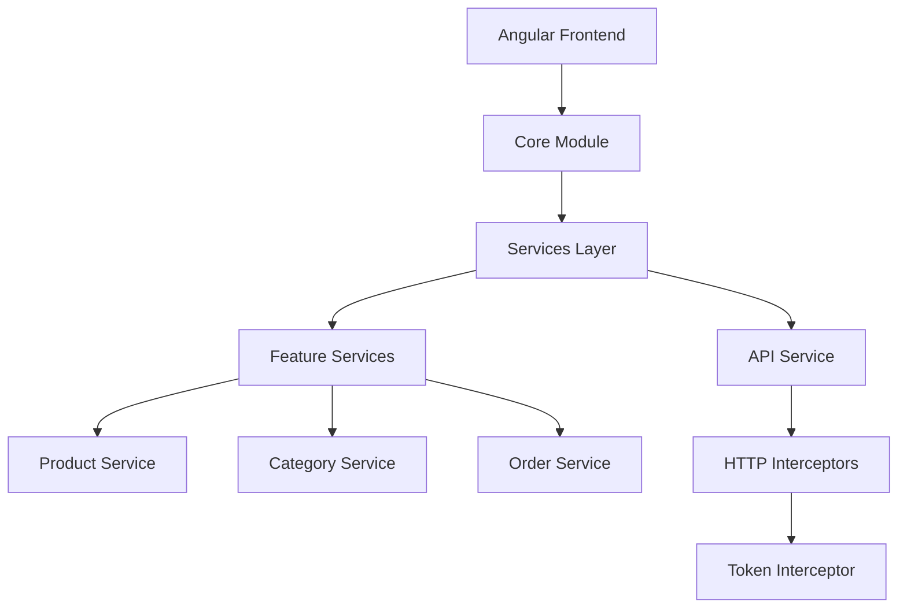
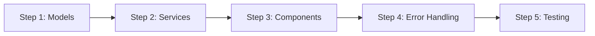

# API Integration Plan for DomainDrivenERP Angular Frontend

## Architecture Overview

The integration will leverage our existing architecture:
- Base `ApiService` for handling HTTP requests
- Versioned backend API endpoints (v1)
- Token interceptor for authentication
- Environment-based configuration

## System Architecture Diagram



## Implementation Steps



### 1. Create Models

Define TypeScript interfaces and types:
- Product interface and related DTOs
- Category interface
- Order interface
- Shared types and enums

### 2. Create Feature Services

Each service will extend base ApiService functionality:

**ProductService**
- Add product
- Apply discount
- Update product name/price
- Get product by ID/SKU
- Get products by category
- Get products by stock quantity

**CategoryService**
- CRUD operations
- Category listing
- Category hierarchy

**OrderService**
- Order management
- Order status tracking
- Order history

### 3. Update Components

- Implement service integration in components
- Add loading states and indicators
- Handle success/error messaging
- Implement proper data binding

### 4. Error Handling

- Global error handling strategy
- Error interceptor implementation
- Specific API error cases:
  - Validation errors
  - Authorization errors
  - Network errors
  - Business logic errors
- User-friendly error messages

### 5. Testing Strategy

- Unit tests for services
- Integration tests for components
- E2E tests for critical flows
- API mock service for testing

## Project Structure

```
src/app/
├── core/
│   ├── models/
│   │   ├── product.model.ts
│   │   ├── category.model.ts
│   │   └── order.model.ts
│   ├── services/
│   │   ├── api.service.ts
│   │   ├── product.service.ts
│   │   ├── category.service.ts
│   │   └── order.service.ts
│   └── interceptors/
│       ├── token.interceptor.ts
│       └── error.interceptor.ts
├── features/
│   ├── products/
│   ├── categories/
│   └── orders/
└── shared/
    ├── components/
    └── utils/
```

## Security Considerations

1. Token-based Authentication
   - JWT token handling
   - Token refresh mechanism
   - Secure token storage

2. Request/Response Security
   - HTTPS enforcement
   - CSRF protection
   - Input validation
   - XSS prevention

3. Error Handling Security
   - Safe error messages
   - Error logging
   - Security error handling

## Implementation Timeline

1. Week 1: Models and Base Services
2. Week 2: Feature Services Implementation
3. Week 3: Component Integration
4. Week 4: Testing and Security Implementation

## Next Steps

1. Set up models and interfaces
2. Implement ProductService
3. Create error handling infrastructure
4. Integrate with existing components
5. Add unit tests